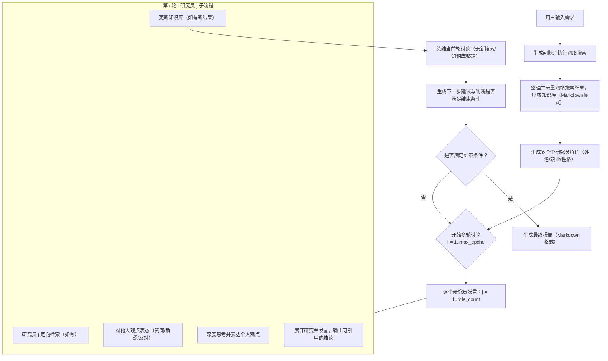

# 多智能体协作讨论研究应用

## 项目简介

本项目旨在通过多智能体协作与深入讨论，帮助用户从复杂的需求中挖掘出有价值的研究结论。系统基于多个角色（研究员）以不同的视角对问题展开讨论，通过多轮深入分析，最终生成结构化的报告。每个研究员都有不同的专业背景和性格，以便从不同角度对同一问题进行分析与讨论，确保结论的全面性与精确性。

## 设计动机与目的

在复杂的研究问题中，往往需要多个角度的视野来分析问题、验证假设，并确保最终得出的结论是多方验证过的。传统的单一视角的讨论往往容易陷入偏见或盲点。本系统通过**多智能体协作**的方式，借助不同角色的交互与互评，达到以下目的：

- **多角度视野**：通过不同职业背景与个性设定的研究员，确保每个问题都从多个视角深入分析。
- **知识共享与迭代**：每个研究员的发言不仅基于现有的知识库，还能通过实时的网络搜索和检索得到补充，确保讨论内容的及时更新。
- **结论追溯与验证**：通过系统化的讨论记录与总结，确保每一轮的讨论都能清晰追溯到其依据的事实和结论。
- **高效的讨论推进与终止判定**：在每一轮结束时，系统生成进度与建议，明确下一步讨论的方向，并在满足条件时终止讨论，避免无效的拖延。

## 使用的应用与模型

* **Qwen3 千问模型**：贯穿整个讨论流程，负责生成研究员的发言、总结及建议。
* **BaiduAISearch 百度AI搜索**：为讨论提供强大的网络搜索功能，帮助获取相关的最新网络信息。

## 流程图



## 核心功能与模块

### 1. 用户需求解析与问题生成
系统根据用户输入的需求，抽象出一系列**可执行的网络搜索问题**。这些问题不仅围绕需求本身，还会根据需求中涉及的名词、规范、背景等领域生成。生成的问题严格要求不重复、清晰且具有针对性，为后续的网络检索打好基础。

### 2. 知识库整理与角色生成
- **知识库整理**：所有的网络检索结果都通过整理与去重形成知识库，避免信息冗余和误导。这个过程只在研究员发言过程中进行，并不会在总结时再次修改。
- **角色生成**：根据用户需求，生成多个**具备不同职业与性格的研究员角色**。每个角色代表不同的专业视角，角色间通过对话与互评产生深度碰撞，从而推动研究的多维度发展。

### 3. 多轮讨论与进展追踪
每一轮的讨论包含**角色逐个发言**、**对他人观点的互评**、**深度思考与个人观点表达**。每一轮结束时，系统将总结当轮的进展，指出已明确达成的结论与待解决的分歧，并根据当前的讨论状态生成**下一步建议**，确保研究方向始终符合用户需求。

### 4. 讨论总结与下一步建议
每轮结束时，系统会根据本轮讨论内容生成**总结**，并根据进展生成**下一步建议**。这些建议将引导下一轮的讨论焦点，确保研究不偏离方向，并减少无效的讨论时间。系统会在多轮讨论中追踪进展，直到达到**最大讨论轮次（max_epcho）**或满足结束条件时停止。

### 5. 知识库更新与验证
研究员在讨论过程中根据网络搜索结果与已有知识库进行信息对比，确保每个观点的**事实依据**。新的信息会被动态加入知识库，供后续角色使用，确保信息的持续更新与验证。知识库的更新只在研究员发言时发生，讨论总结时不会对其做任何修改。

## 技术架构与实现

本系统通过大语言模型（如 `QwenModel`）以及搜索引擎API（如 `web_search`）协同工作，依赖以下关键技术组件：
- **大语言模型（LLM）**：负责生成角色发言、总结以及生成建议。
- **网络搜索引擎**：为讨论提供实时的网络检索支持，确保信息的最新性与准确性。
- **知识库管理**：用于存储和整理网络搜索结果及每轮讨论的发言记录。

## 使用说明

### 环境要求
- Python 3.11+
- 安装依赖：
  ```bash
    pip install requests dashscope json uuid
  ```

### 运行测试
当遇到复杂问题或缺乏明确思路时，用户可以将问题作为需求输入，并调用`start_meeting`启动讨论研究。如果用户需求更为明确（例如规范、限定条件或生成目标效果），将有助于生成更精确的结果。`test.py`中包含三个测试用例，用户可以运行进行验证。

### 配置
* `setting.json` 是配置文件，包含以下核心字段：

  * `max_epcho`：最大讨论轮数，研究员按顺序发言后算作一轮。
  * `role_count`：生成的角色数量。
  * `qwen_key`：通义千问模型 API Key，既用于对话也可作为 DashScope 搜索的默认密钥。
  * `search_provider`：网络搜索提供方，当前支持 `dashscope`（默认）与 `baidu`。
  * `dashscope_search_key`：DashScope WebSearch 专用密钥（可复用 `qwen_key`）。
  * `dashscope_search_endpoint`：DashScope WebSearch 接口地址，默认 `https://dashscope.aliyuncs.com/api/v1/services/aigc/websearch`。
  * `baidu_key`：百度千帆智能搜索密钥（仅在选择 `baidu` 提供方时需要）。
  * `search_top_k`：检索结果条数上限。
  * `search_timeout`：搜索 HTTP 请求超时时间（秒）。

### 搜索服务配置
- 默认使用 **阿里云通义千问 WebSearch API**（国内可用，具备来源、引用信息），只需在 `setting.json` 中填入 `dashscope_search_key` 即可。
- 如需改用其他国内搜索服务，可将 `search_provider` 切换为 `baidu`，并填入 `baidu_key`。新的搜索接口可以通过扩展 `search_service.py` 中的提供方类接入。
- 若需要接入自定义国内搜索 API，可保持 `search_provider` 为 `dashscope`，改写 `dashscope_search_endpoint`、`search_top_k` 等参数，或仿照现有类新增实现。

### 启动流程
1. 创建 `QwenModel` 实例：`qwen_model = QwenModel(model_name="qwen-plus-latest")`
2. 调用 `start_meeting` 启动会议：`result_content = start_meeting(qwen_model, que1, stream)`

### 输出
- 系统输出最终的讨论报告（Markdown格式），可直接用于用户需求的汇报、分析或进一步的研究分析。

## 贡献与扩展

1. **贡献**：我们欢迎任何与该项目相关的改进或补充，特别是在角色生成、知识库管理、搜索引擎等模块方面。
2. **扩展**：未来可以增加更多的角色类型、增强搜索引擎的能力（如RAG，知识图谱检索）、引入更多高级的分析与总结技术等，进一步提升系统的智能化水平。
